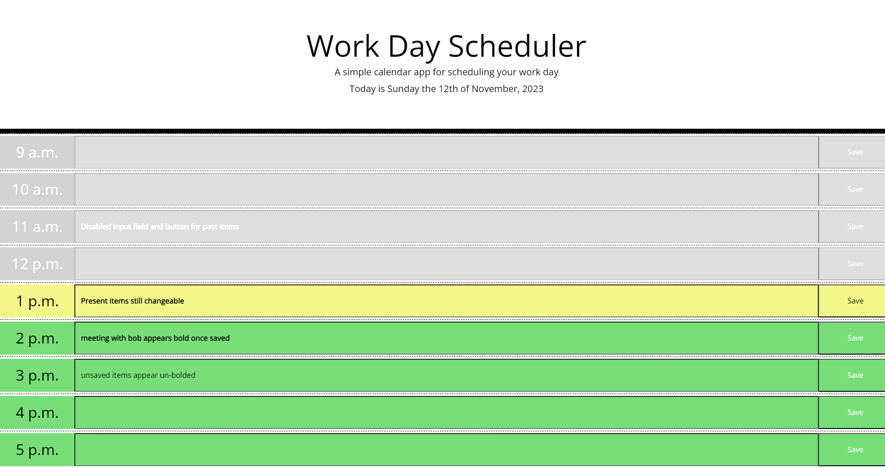

# Planner
A online daily planner.


## Description

This webpage demonstrates my ability to use some javascript logic to dynamically generate html for an interactive day planner and utilize dayjs and bootstrap libraries to some small extent.  

Information can be put into the input fields in each hour block and saved to local storage for persistence by using the corresponding save button.
It only stores one day at a time in local storage and discards old information from past days upon loading the page.

## Table of Contents

Included for your ease of use is a table of contents

- [Installation](#installation)
- [Usage](#usage)
- [Credits](#credits)
- [Screenshots](#screenshots)
- [License](#license)

## Installation
  
If you wish to work on the files for this project you can clone it onto your machine and republish it wherever you like.
  
```Git clone command```  
```
git clone git@github.com:kevinstaresdarbon/Planner.git
```
  
if you simply wish to view the page you can use this link:  
[Daily_Planner](https://kevinstaresdarbon.github.io/Planner/)

## Usage
  
This webpage is mainly for instructional purposes but also provides an intuitive daily planner for your work day with some visual effects to give feedback to the user upon taking actions on the page
  
## Credits
  
The starter code at the initial starter commit, HTML and CSS files was provided by the staff of edX.  
All commits after that is original work done by myself.  
No collaboration was needed or taken on this repository and code.  
  
The template and advice for this README was taken from this site:  
<https://coding-boot-camp.github.io/full-stack/github/professional-readme-guide>  
  
## Screenshots  
  
Below are the screenshots of the finished challenge:
  
Above 1200px wide:  
  

  
## License  
  
MIT License citation is supplied [HERE](./LICENSE)
